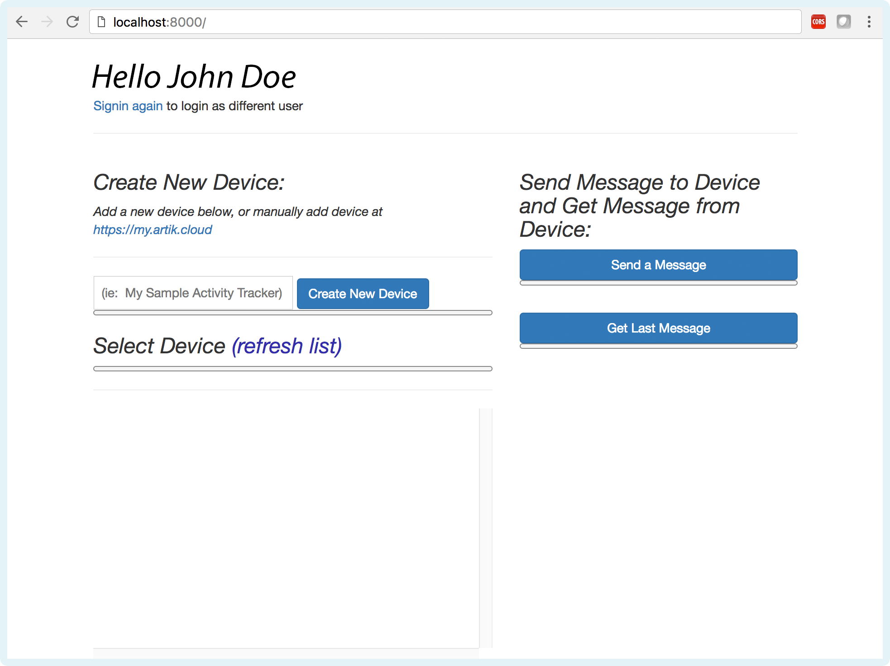
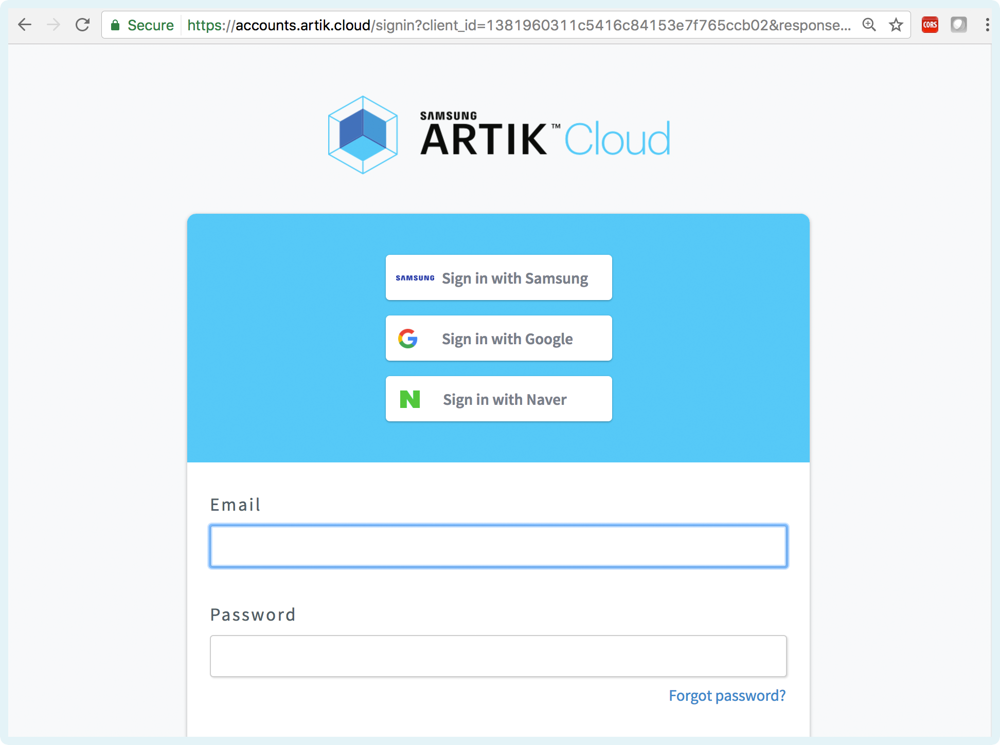
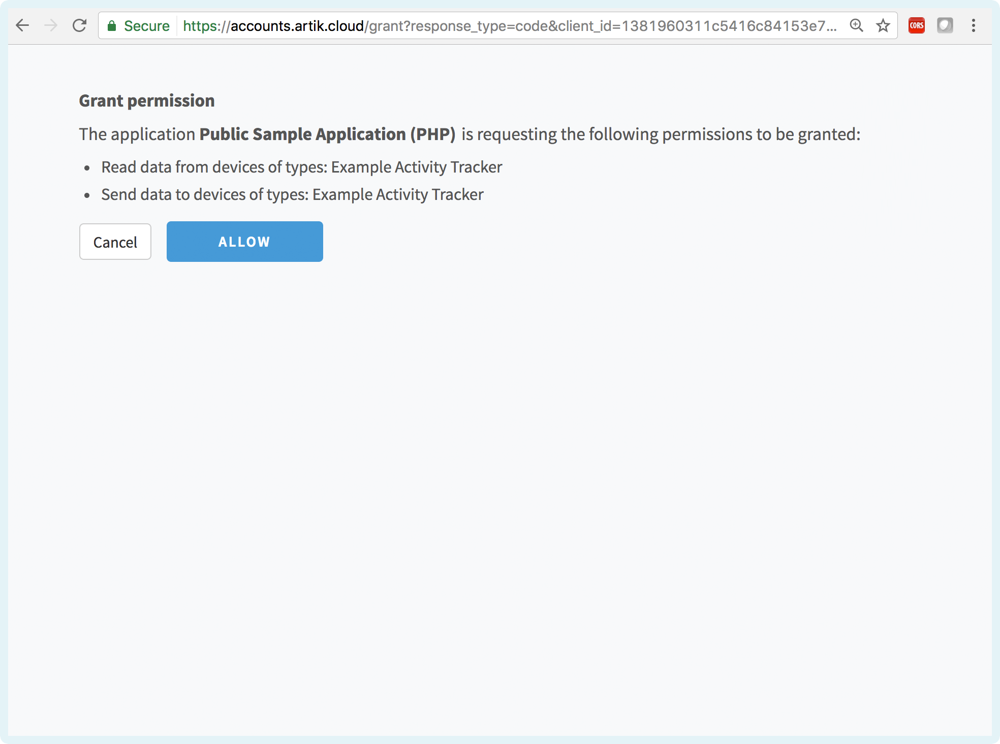
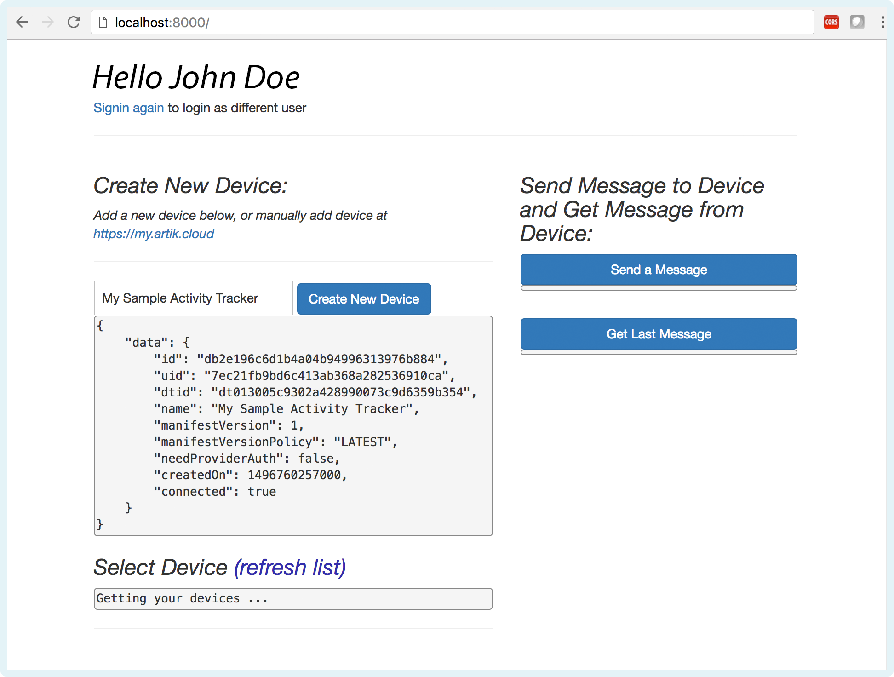
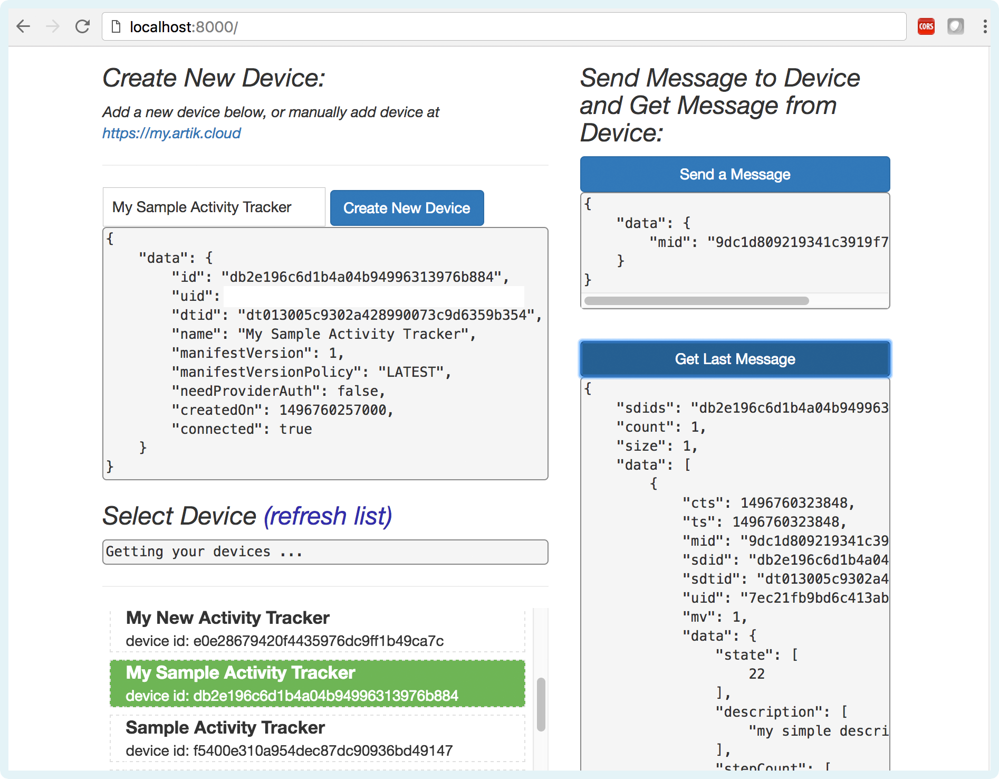

# Sample Web Application using ARTIK Cloud PHP SDK 

This is a sample web application demonstrating usage of the **ARTIK Cloud PHP SDK**.   This sample was built using the [symfony web framework](https://symfony.com/) and [ARTIK Cloud PHP SDK (version 2.0.7)](https://github.com/artikcloud/artikcloud-php).

**After completing this sample, you will learn the following concepts:**

- Setting up <u>ARTIK Cloud Application</u> and adding <u>Application Device Type Permissions</u>
- <u>ARTIK Cloud Login</u> and <u>Granting Permissions</u> for an Application to read / write to device.
- <u>Importing and using the ARTIK Cloud PHP SDK</u> 

**Note**:  Please keep in mind this sample is intended for demonstration purposes as a learning tool and IS NOT recommended for use in a production environment *as-is*.  It is recommended you follow any security policies of your organization.

## Requirements

- [PHP](http://php.net/manual/en/install.php)  (Version >= 5.5.0)
- [Composer - Installation](https://getcomposer.org/)

## Setup

### Setup at ARTIK Cloud

Follow [these instructions](https://developer.artik.cloud/documentation/tools/web-tools.html#creating-an-application) to create an ARTIK Cloud Application.  Here are the settings for this sample: 

-  Under “AUTHORIZATION METHODS” and enable AUTH CODE

- Set “REDIRECT URL” to http://localhost:8000/callback/artikcloud 

- Under “PERMISSIONS”, check “Read” for “Profile”

   Click the “Add Device Type” button. 

   Choose “Example Activity Tracker” as the Device Type

   - Unique Name: cloud.artik.example.activitytracker    


-    Device Type Id: dt013005c9302a428990073c9d6359b354

   Enable “Read” and “Write” permissions for this Device Type.

```
Note the Client Id and Client Secret, which you will need later for the configuration file.
```

Add the **Example Activity Tracker** into your account (or you can add this later when running the sample app)

- Go to https://my.artik.cloud and go to the Devices menu
- Click on **Add Another Device** and add the **Example Activity Tracker**.    

### Setup Code

This project uses [symfony](https://symfony.com/) web framework.

Here are all the modified files of interest you should peek into:

```
composer.json   // dependencies for installation using composer
app/Resources/views/default/index.html.twig   //frondend view
app/config/config_prod.yml	//configuration parameters
src/AppBundle/Controller/DefaultController.php	//webapp controller
```

Configure the `app/config/config_prod.yml file` 

```
parameters:
    client_id: 'your_client_id'
    client_secret: 'your_client_secret'
    redirect_uri: 'http://localhost:8000/callback/artikcloud '
    device_type_id: 'dt013005c9302a428990073c9d6359b354'
    device_type_unique_name: 'cloud.artik.example.activitytracker'
```

### **Run Project**:

In your project folder, run composer so it installs dependencies needed for this project:

 ```
composer install
 ```

Now load up your project using your web server.   Here are some options below:

**Apache**: Setup Apache to serve your files via the /web directory and listen on port 8000.

**Alternatively**, you can run with <u>PHP's built-in webserver</u> by running following command:

```
cd your_project_name/
composer install
php bin/console --env=prod cache:clear
php bin/console server:run
```

#### **Run Project:**

###### View your project using your brower:  http://localhost:8000  

## Demo / Screenshots:
#### Overview of the sample application  

#### Login Screen
  
#### Each user will see the Application Permission Screen Once
  
#### Create a new Device or Select an existing Device
  
#### Send Message and Get Last Message
Message sent to the device is defined in the controller file: `src/AppBundle/Controller/DefaultController.php`
  

## More about ARTIK Cloud

If you are not familiar with ARTIK Cloud, we have extensive documentation at [https://developer.artik.cloud/documentation](https://developer.artik.cloud/documentation)

The full ARTIK Cloud API specification can be found at [https://developer.artik.cloud/documentation/api-spec.html](https://developer.artik.cloud/documentation/api-spec.html)

Peek into advanced sample applications at [https://developer.artik.cloud/documentation/samples/](https://developer.artik.cloud/documentation/samples/)

To create and manage your services and devices on ARTIK Cloud, visit the Developer Dashboard at [https://developer.artik.cloud](https://developer.artik.cloud/)

## License and Copyright

Licensed under the Apache License. See [LICENSE](https://github.com/artikcloud/sample-webapp-php/blob/master/LICENSE).

Copyright (c) 2017 Samsung Electronics Co., Ltd.
